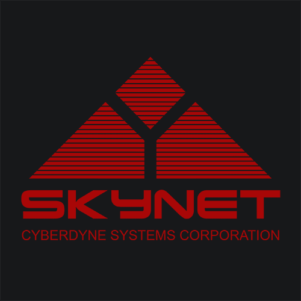

<!--
*** Thanks for checking out this README Template. If you have a suggestion that would
*** make this better, please fork the repo and create a pull request or simply open
*** an issue with the tag "enhancement".
*** Thanks again! Now go create something AMAZING! :D
***
***
***
*** To avoid retyping too much info. Do a search and replace for the following:
*** tylertaewook, arduino-turret, alitecraft, taewook.kim@columbia.edu
-->

<!-- PROJECT SHIELDS -->
<!--
*** I'm using markdown "reference style" links for readability.
*** Reference links are enclosed in brackets [ ] instead of parentheses ( ).
*** See the bottom of this document for the declaration of the reference variables
*** for contributors-url, forks-url, etc. This is an optional, concise syntax you may use.
*** https://www.markdownguide.org/basic-syntax/#reference-style-links
-->

<!-- PROJECT LOGO -->
 

  

  <h3 align="center">Arduino-Controlled Airsoft Turret (T-33)</h3>

  

    Terminator-inspired Turret Project Controlled with C# WinForms App
     
    <a href="https://github.com/tylertaewook/arduino-turret"><strong>Explore the docs »</strong></a>
     
     
    <a href="https://github.com/tylertaewook/arduino-turret">View Demo</a>
    ·
    <a href="https://github.com/tylertaewook/arduino-turret/issues">Report Bug</a>
    ·
    <a href="https://github.com/tylertaewook/arduino-turret/issues">Request Feature</a>
  

<!-- TABLE OF CONTENTS -->
## Table of Contents

* [About the Project](#about-the-project)
  * [Airsoft Turret](#airsoft-turret)
  * [WinForms App](#winforms-app)
* [Build Notes](#build-notes)
* [Contact](#contact)
* [Acknowledgements](#acknowledgements)

<!-- ABOUT THE PROJECT -->
## About The Project

T-33 is an airsoft turret controlled by Arduino and C# WinForms application inspired by the movie Terminator. It is the first project that led the author into the world of computer science and engineering, self-teaching C# and Arduino in the process.
This project was done completely independently during the summer of 2015, taking approximately three months to complete.

Since most files were recovered from an old laptop, please excuse the low quality images and codes.

### Airsoft Turret

The T-33 turret has following features:
* [Pan/Tilt motion of the gun]
* [Electric Firing mechanism(semi-auto/full-auto)]
* [5W Laser Beam]
* [26 High-Power LED lights]
* [Bluetooth COM connection with WinForms App]
* [720p Wireless Webcam Feed]

The main arduino board is made of three levels: main Arduino-UNO, Quad-Relay sheild, and a custom shield to solder rest of the components.

The Relay shield and its built-in Arduino library made it easier to control all the different features: Firing, Laser, and LED lights.
The custom shield on top connected HC-06 Bluetooth model for communication and Pan/Tilt servo motors.

Although I tried to find the strongest servo possible for panning motion, the heavy weight of turret itself could not be moved with my servo.
Therefore, I hooked up a 3:1 metal gear with the main turret and the servo to make the panning smooth as possible. This tripled the servo's torque but limited the panning range from 180 degrees to 60 degrees.

### WinForms App

Self-teaching C# for a week or two was enough to create a basic WinForms app to communicate with the turret. As an excited 15-year old, I spent majority of my time making the software look cool as possible.
Unfortunately, the original code file was corrupted in an old laptop, so I could only upload the photos of code I took five years ago. (WinForms Application Code Folder)

This is the booting screen that pops up when you first click the skynet.exe (yes, that's how I named it)
Of course, the loading bar is completely decorational as there's nothing much to load anyways.

This is the connecting screen where you can use the bottom-left and top-right box to connect to the turret.
There are two ways to connect to the turret:
* [Connecting through USB port directly to the Arduino (Given proper Portname and Baud Rate)]
* [Connecting through Bluetooth model that pops up on the top-right box]

Finally, the highlight of this application. This controlling screen is the main GUI where you can use on-screen buttons or your keyboard to control the turret.
I'll explain the features starting from top-left:
* [Status]
  * Based on the time it has fired, calculates a rough approximate of BB-bullets left;
  * Automatically stops firing if the OVERHEAT gauge reaches the top
* [Tilt] - Up/Down Arrow Key
  * Calculates and visualizes the tilt of turret
* [CAM1]
  * Shows wireless webcam's feed in real time (the image above is a placeholder)
* [PAN] - Right/Left Arrow Key
  * Calculates and visualizes the pan of turret
* [Scan Mode] - 'S' Key
  * When toggled, turret slowly pans back and forth
* [Angle]
  * [Roughly calculates the current pan/tilt value]
* [CMD]
  * [Prints any errors/logs/bullets left]
* [Arrows]
  * [You can click these arrows or use keyboard to pan/tilt/fire]
* [Firing Mode] 'F' Key (respect)
  * [Switch between semi-auto/full-auto]
* [Lights] ','(LED) '.'(Laser)
  * [Toggles the LED lights and Laser]
* [Reload Mode] 'R' Key
  * [When bullets have ran out, the gun will automatically point down, waiting for user to reload]
* [Unimplemented]

<!-- BUILD NOTES -->
## Build Notes

The first prototype was a simple model made of foamboard and a single servomotor to design the final turret. After several foamboard prototypes, this was the final version I liked the most.

According to the prototype's design, I visited RaonSquare(http://raonsquare.com/), a small company dedicated to building interactive art experience using Arduino. There, I met Jae-Pil Choi who taught and helped me creating CAD designs using Adobe Illustrator. During this two-hour meeting, Mr. Choi consulted me on overall product design process and gave feedbacks on some of my Arduino wiring plans

After finishing CAD design, I bought four 5mm MDF boards in a local woodworking shop and brought them to a small FABLAB in Korea University. With a small fee of approx. $30, a plain MDF boards became the structural components of my turret.

These parts were beautifully assembled with a combination of wood screws and wood glue. 

Modifying the airsoft gun was perhaps to most straight-forward part. I purchased a cheap G39 motor airsoft gun from a local shop, and disassembled them. In order to fire the gun electrically, all I had to do was replace the wires on the main motor and pull it outside. This way, the gun would automatically fire when two wires were connected through a simple relay.

Last but not least, the most exciting part awaits: painting and decorating. Because the entire turret was made of MDF boards, a board vulnerable to water, I had to use MDF primer first before adding the beautiful gray paint that suits the terminator-vibe. After the initial paint dried, I applied the SKYNET logo and T-33 text on the side of the turret before coating with the sealer.

<!-- CONTACT -->
## Contact

Tyler Kim - taewook.kim@columbia.edu

Project Link: [https://github.com/tylertaewook/arduino-turret](https://github.com/tylertaewook/arduino-turret)

<!-- ACKNOWLEDGEMENTS -->
## Acknowledgements

* [Jae Pil Choi, RaonSquare]

<!-- MARKDOWN LINKS & IMAGES -->
<!-- https://www.markdownguide.org/basic-syntax/#reference-style-links -->
[contributors-shield]: https://img.shields.io/github/contributors/tylertaewook/repo.svg?style=flat-square
[contributors-url]: https://github.com/tylertaewook/repo/graphs/contributors
[forks-shield]: https://img.shields.io/github/forks/tylertaewook/repo.svg?style=flat-square
[forks-url]: https://github.com/tylertaewook/repo/network/members
[stars-shield]: https://img.shields.io/github/stars/tylertaewook/repo.svg?style=flat-square
[stars-url]: https://github.com/tylertaewook/repo/stargazers
[issues-shield]: https://img.shields.io/github/issues/tylertaewook/repo.svg?style=flat-square
[issues-url]: https://github.com/tylertaewook/repo/issues
[license-shield]: https://img.shields.io/github/license/tylertaewook/repo.svg?style=flat-square
[license-url]: https://github.com/tylertaewook/repo/blob/master/LICENSE.txt
[linkedin-shield]: https://img.shields.io/badge/-LinkedIn-black.svg?style=flat-square&logo=linkedin&colorB=555
[linkedin-url]: https://linkedin.com/in/tylertaewook
[product-screenshot]: images/screenshot.png
